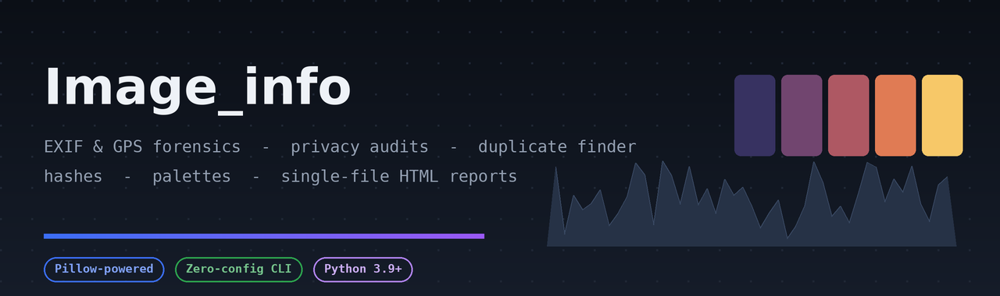
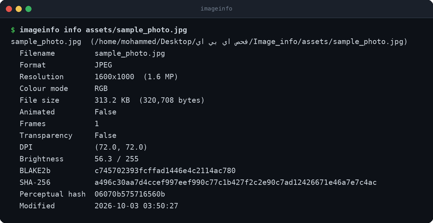
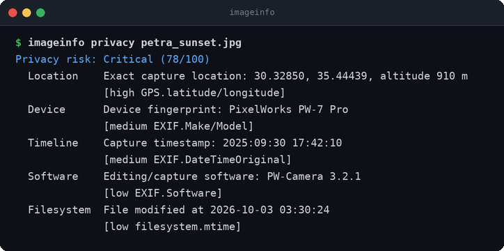
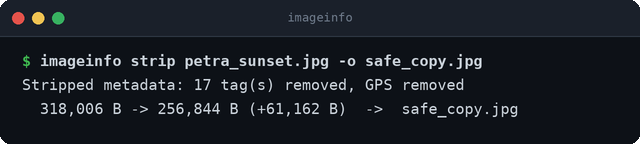
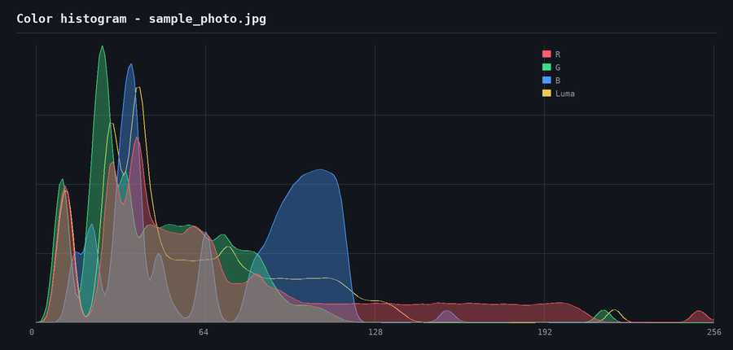
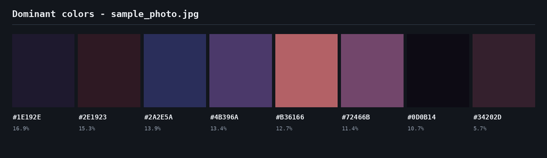
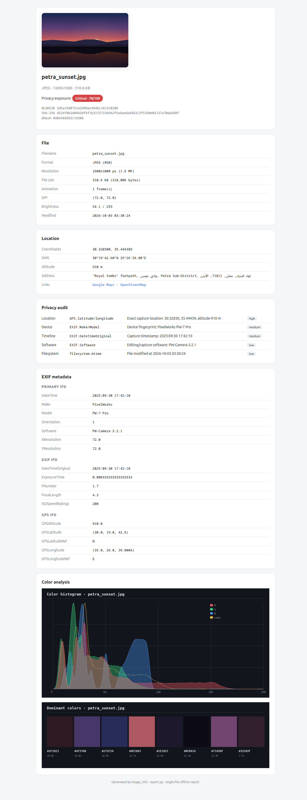
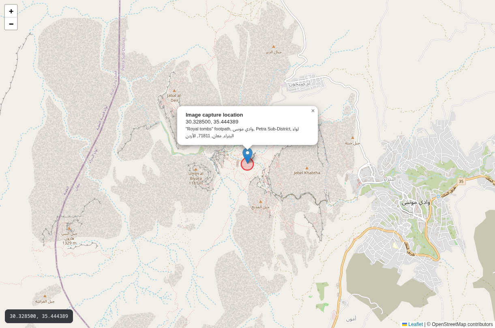

<div align="center">



**Inspect, audit and clean image metadata — EXIF & GPS forensics, privacy risk scoring,
perceptual hashing, duplicate detection, colour palettes and single-file HTML reports.**

[](https://github.com/ALSRKAL/Image_info/actions/workflows/ci.yml)
[](https://www.python.org/downloads/)
[](LICENSE)
[](https://python-pillow.org/)

</div>

---

Every photo is a small database about your life. It usually knows **where** you were,
**which device** you own, **when** you were there — and sometimes even the camera's serial
number. **Image_info** opens that database: it shows you exactly what a file leaks, scores
the privacy risk, and can produce a metadata-free copy that is safe to share. On top of
that it analyses images technically (hashes, palettes, histograms) and finds duplicate
photos across a library using perceptual hashing.

## Highlights

| | |
|---|---|
| 📍 **GPS forensics** | Decimal + DMS coordinates, altitude, reverse geocoding (Nominatim) and a self-contained Leaflet map — no API keys, unlike the Google-Maps approach this project started with |
| 🛡 **Privacy audit** | A 0–100 risk score across 6 categories (location, device, timeline, identity, comments, filesystem) with a plain-language explanation for every finding |
| 🧹 **Metadata stripping** | Rebuilds the image from raw pixels: EXIF, GPS, XMP and comments are gone, orientation is baked in so the photo still displays upright |
| 🔎 **Duplicate finder** | dHash perceptual hashing with a brightness tie-breaker, so renamed, re-saved and re-compressed copies are caught — while solid-colour images don't false-positive |
| 📊 **Colour analysis** | RGB + luminance histograms and dominant-colour palettes, drawn with Pillow itself — **zero heavy dependencies** |
| 📄 **HTML reports** | A single, self-contained `.html` file with the thumbnail, tables, maps and charts embedded as base64 — works offline, shareable anywhere |
| ⌨️ **Full CLI + library** | 15 `imageinfo` subcommands and a typed Python API over the same engine |

## Screenshots

```bash
$ imageinfo demo          # generate sample photos, then try:
$ imageinfo info petra_sunset.jpg
```

<div align="center">

</div>

```bash
$ imageinfo privacy petra_sunset.jpg
```

<div align="center">

</div>

Every finding is scored and explained — then one command produces a share-safe copy:

<div align="center">

</div>

### Colour analysis (rendered by the tool, no matplotlib)

<div align="center">


</div>

### HTML report and GPS map

`imageinfo report petra_sunset.jpg` produces a standalone page — thumbnail, risk badge,
EXIF tables, location card, embedded charts:

<div align="center">
<table><tr>
<td></td>
<td></td>
</tr></table>
</div>

The map is a single offline-capable HTML file (Leaflet + OpenStreetMap) with the
reverse-geocoded address in the popup — generated without any API key.

## Installation

```bash
git clone https://github.com/ALSRKAL/Image_info.git
cd Image_info
pip install .          # only hard dependency: Pillow
```

Verify and generate a playground:

```bash
imageinfo --version
imageinfo demo         # creates image_info_demo/ with sample photos
```

## CLI reference

| Command | What it does |
|---|---|
| `imageinfo info IMG [--json]` | Technical snapshot: format, resolution, size, hashes, palette |
| `imageinfo exif IMG [--json]` | Full EXIF dump with readable tag names |
| `imageinfo gps IMG [--map out.html] [--no-geocode]` | Coordinates, address, Google/OSM links, Leaflet map |
| `imageinfo privacy IMG [--json]` | What does this file leak? Scored findings |
| `imageinfo strip IMG [-o OUT]` | Write a metadata-free copy (orientation preserved) |
| `imageinfo report IMG [-o out.html]` | Single-file HTML analysis report |
| `imageinfo histogram IMG [-o out.png]` | RGB + luminance histogram chart |
| `imageinfo palette IMG [-n 8] [-o out.png]` | Dominant colour palette |
| `imageinfo hash IMG...` | BLAKE2b + SHA-256 + perceptual hash |
| `imageinfo compare A B` | Verdict: identical / very similar / different |
| `imageinfo convert IMG --format png [-o OUT]` | Format conversion |
| `imageinfo resize IMG --width 1280 [-o OUT]` | Resize (aspect ratio kept when one side given) |
| `imageinfo scan DIR [-r] [--json] [--csv out.csv]` | Batch-inspect a whole directory |
| `imageinfo duplicates DIR` | Group visually duplicate images |
| `imageinfo demo [--dir DIR]` | Generate sample photos with real EXIF/GPS to play with |

## Library usage

```python
from image_info import analyze, strip_metadata

result = analyze("petra_sunset.jpg", geocode=True)

print(result.info.resolution)        # 1600x1000
print(result.exif.camera)            # ('PixelWorks', 'PW-7 Pro')
print(result.exif.gps)               # (30.3285, 35.444389)
print(result.address)                # 'Petra, Wadi Musa, Maan, Jordan'
print(result.privacy.risk_level)     # 'Critical'

# one call to make it share-safe:
strip_metadata("petra_sunset.jpg", "safe.jpg")
```

Lower-level pieces are importable individually:

```python
from image_info import ImageInfo, ExifData, find_duplicates, scan_directory

for info in scan_directory("~/Pictures", recursive=True):
    print(info.filename, info.dhash)

for group in find_duplicates("~/Pictures"):
    print("duplicates:", [i.filename for i in group])
```

More in [`examples/`](examples/): `basic_usage.py`, `privacy_audit.py`,
`find_duplicates.py`, `batch_catalogue.py`.

## How the privacy score works

Each finding adds points; the sum (capped at 100) maps to a level.

| Finding | Category | Points | Severity |
|---|---|---:|---|
| GPS coordinates | Location | 45 | high |
| Serial numbers / unique IDs | Identity | 10 | high |
| Camera make & model | Device | 12 | medium |
| Capture timestamp | Timeline | 12 | medium |
| Artist / copyright / owner | Identity | 8 | medium |
| Embedded comments | Comments | 8 | medium |
| XMP packet | Container | 6 | low |
| Editing software | Software | 5 | low |
| Filesystem timestamps | Filesystem | 4 | low |

**0–19** Low · **20–49** Medium · **50–74** High · **75+** Critical

## How duplicate detection works

1. Each image is downscaled to 9×8 greyscale and turned into a 64-bit *difference hash*
   (dHash): a bit is set when a pixel is brighter than its neighbour.
2. Images whose hashes differ by ≤ `threshold` bits (default 8) are candidates.
3. A brightness tie-breaker splits candidates whose mean luminance differs by more than
   16/255 — this prevents the classic dHash trap where *any* two solid-colour images
   hash identically.

## Project layout

```
Image_info/
├── image_info/
│   ├── core.py        # ImageInfo: snapshot, hashes, dHash, palette
│   ├── exif.py        # EXIF/GPS parsing, readable tag names
│   ├── privacy.py     # risk scoring + metadata stripping
│   ├── visualize.py   # histogram & palette rendering (pure Pillow)
│   ├── maps.py        # Leaflet maps + hardened Nominatim client
│   ├── report.py      # single-file HTML reports
│   ├── export.py      # batch scan, JSON/CSV, duplicate finder
│   ├── demo.py        # synthetic sample photos with real EXIF/GPS
│   └── cli.py         # the imageinfo command line
├── tests/             # 90 pytest cases
├── examples/          # runnable recipes
├── tools/             # asset generation for this README
└── assets/            # screenshots (regenerable)
```

## Development

```bash
pip install -e ".[dev]"
pytest -v
python tools/make_assets.py     # regenerate README screenshots
```

## Notes

- Reverse geocoding uses the public [Nominatim](https://nominatim.org/) service through a
  hardened client (HTTPS-only, pinned host, private-address filtering, redirect blocking).
  It is optional — every command works fully offline with `--no-geocode`.
- The sample photos under `imageinfo demo` are synthetic and their metadata is generated,
  not harvested from real devices.

## License

[MIT](LICENSE) © Mohammed Alsrkal
